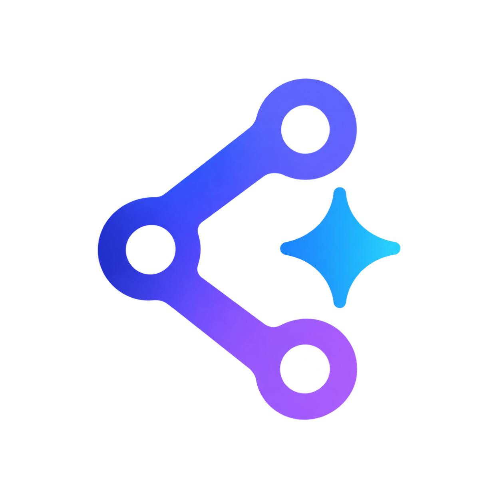

<p align="center">
  
</p>

<h1 align="center">AskRepo</h1>

<p align="center">Ask questions about a codebase and get grounded, cited answers.</p>

AskRepo clones a repository, indexes it into a vector store, and answers natural-language
questions about it — citing the actual files and functions the answer came from. It is
**self-hosted and single-tenant**: an organization runs its own instance on its own
infrastructure, provisions accounts for its developers, and keeps it on the internal
network.

Built as a learning project for RAG, LangChain/LangGraph, prompt engineering, and context
management — against real repositories rather than tutorial data.

> **Status: M0, M1, M2, M3, M4 and M5 shipped.** Auth & accounts are implemented —
> admin-provisioned users, login, forced first-login password change, and login rate
> limiting — as are the project routes and the whole ingestion pipeline: clone, walk,
> chunk, embed, Qdrant, driven by a Kafka job queue and a separate worker process.
> `POST /projects` enqueues a repository and a worker indexes it in the background.
> M2 added Dev Knowledge: ask a question about a ready project and the answer streams
> back token by token over Server-Sent Events, cited to real files and line ranges,
> with conversations private to whoever had them. M3 turned the answer path into a
> LangGraph state graph: questions are routed (codebase question / conversational /
> out of scope) before anything is retrieved, and on the codebase path a grader
> checks the retrieved excerpts and re-searches with a better query when they fall
> short — the loop grades retrieval, not the finished answer, so streaming stays
> unaffected. M4 added the QA Checklist: a user names a module, AskRepo generates
> test cases with expected results grounded in the code, nothing enters the checklist
> unreviewed, a shared conversation proposes further changes, and testers record
> pass/fail/blocked results — all exported to `.xlsx`. M5 added the Mock Data Generator:
> for a QA Checklist module, AskRepo proposes a grounded sample dataset from the module's
> actual schema, refined the same way as the checklist — chat, a pending change set,
> then apply — and exported as JSON or `.xlsx`. **The M0–M2, M4 and M5 frontend is
> shipped too**: sign in, change the forced initial password, add and re-index
> projects, ask questions with the answer streaming in, manage accounts, work the
> checklist, and generate its mock data — all in a browser, with the session held in
> httpOnly cookies by Next rather than in the page. See [Roadmap](#roadmap) for what
> lands when, and
> [`docs/PRD.md`](docs/PRD.md) for the full specification.

## Features (planned)

| | Feature | What it does |
| --- | --- | --- |
| **0** | Auth & Accounts | Admin-provisioned email/password accounts, JWT access + revocable refresh tokens |
| **1** | Project ingestion | Submit a repo URL; AskRepo clones, indexes, and tracks it. Projects are shared instance-wide |
| **2** | Dev Knowledge | Ask questions against an indexed project; answers cite real file paths and functions. Conversations stay private to each user |
| **3** | QA Checklist | Generate test cases for a code module, review and refine them via chat, record pass/fail/blocked results, and export as a spreadsheet |
| **4** | Mock Data Generator | Generate sample data records for a QA Checklist module, grounded in that feature's actual schema, reviewed via chat and exported as JSON/xlsx |

## Stack

**Backend** FastAPI · Python 3.13 · uv · SQLAlchemy + Alembic · LangGraph · LangChain
**Frontend** Next.js 16 · React 19 · TypeScript · Tailwind CSS 4 · Bun
**Data** Postgres 17 · Qdrant · Redis · Kafka
**Models** Ollama (qwen2.5-coder, qwen3), run on the host rather than in Compose, with a
hosted-API adapter for comparison
**Infra** Docker Compose · Caddy · VPN/Tailscale only, not internet-facing

## Repository layout

```
ask-repo/
├── backend/            FastAPI service — see backend/README.md
├── frontend/           Next.js UI — see frontend/README.md
├── infra/              Dockerfiles + compose files (dev and prod)
├── docs/
│   ├── PRD.md          Product requirements — the source of truth
│   ├── installation.md   Step-by-step local setup
│   ├── deployment.md     Running it for a team
│   ├── configuration.md  Every setting, what it does, what to change for production
│   └── design.md       Design tokens, layout geometry, component inventory
├── assets/             Brand source files — logo.png and the favicon set
├── .claude/            Rules, commands and skills for AI agents
└── Makefile            Task runner — `make help`
```

## Quick start

The short version is below; [`docs/installation.md`](docs/installation.md) is the same thing
step by step, with a troubleshooting section.

**Requirements:** Docker with Compose v2, [Ollama](https://ollama.com) installed **on the
host**, plus [uv](https://docs.astral.sh/uv/) and [Bun](https://bun.sh) if you want to run the
apps outside containers.

```bash
curl -LsSf https://astral.sh/uv/install.sh | sh   # backend
curl -fsSL https://bun.sh/install | bash          # frontend
```

Ollama is deliberately **not** in the Compose stack. A container gets no GPU on macOS and only
the Docker VM's memory allowance, so a model inside one runs on CPU in a slice of RAM; run by
the host it gets Metal and the whole machine. Start it once and pull the models:

```bash
ollama serve        # or the menu-bar app
make pull-models    # nomic-embed-text + qwen2.5-coder:14b, ~10 GB
```

A Linux box with the NVIDIA runtime can put it back in Docker —
[`docs/configuration.md`](docs/configuration.md#running-ollama-in-docker-anyway).

### Everything in Docker

The apps and datastores; Ollama still on the host, reached at `host.docker.internal:11434`:

```bash
git clone <this-repo> && cd ask-repo
launchctl setenv OLLAMA_HOST "0.0.0.0:11434"      # macOS: let containers reach it
BOOTSTRAP_ADMIN_PASSWORD=<a real passphrase> make up
```

`BOOTSTRAP_ADMIN_PASSWORD` must be set before the first `make seed` or `make up` — the seed
command refuses to run without it rather than inventing a password, and the backend
container will not come up without it either. There is deliberately no built-in default: a
password committed to this repository would be a password every reader of it already knows.
Log in as `superuser@example.com` (or `admin@example.com`) with that password; both accounts
are created with `must_change_password` set, so the first login forces a change.

### Datastores in Docker, apps on your machine

The usual development loop — hot reload on both apps, datastores containerized:

```bash
make setup                                        # uv sync + bun install
make infra                                        # postgres + qdrant + redis + kafka, waits until healthy
make migrate                                       # apply database migrations
BOOTSTRAP_ADMIN_PASSWORD=<a real passphrase> make seed  # create the bootstrap admins
make dev                                           # both dev servers + the worker, Ctrl-C stops all
```

`make infra` and `make dev` both check that the host Ollama is answering on `:11434` and print
a warning if it is not — the worker otherwise dies probing embedding dimensions, in a log
stream interleaved with two others. It is a warning, never a failure, because an instance on a
hosted embedding or chat provider correctly has no Ollama.

| Service | URL |
| --- | --- |
| Frontend | <http://localhost:3000> |
| API | <http://localhost:8000> ([docs](http://localhost:8000/docs)) |
| Qdrant dashboard | <http://localhost:6333/dashboard> |
| Postgres | `localhost:5432` |
| Redis | `localhost:6379` |
| Kafka | `localhost:9092` |
| Ollama | `localhost:11434` (embeddings + answers) — **runs on the host, not in Compose** |

The **worker** publishes no port — it is reached through Kafka, not HTTP. It consumes both
ingestion and checklist-generation jobs, so nothing indexes and no checklist is generated
without one. `make up` runs two replicas, one per ingest partition; `make dev` runs a single
one alongside the dev servers, and `make worker` runs one on its own. See
[`backend/README.md`](backend/README.md#the-ingestion-worker).

Every environment value has a fallback, so this comes up with no `.env` file. To customize,
create `infra/.env` — every variable it accepts is listed in
[`docs/configuration.md`](docs/configuration.md#docker-compose-infraenv).

Verify the API is alive, then log in as a seeded admin (replace the password with the one you
set in `BOOTSTRAP_ADMIN_PASSWORD`):

```bash
curl -s localhost:8000/ | jq
curl -s localhost:8000/health | jq
curl -s -X POST localhost:8000/auth/login \
  -H 'Content-Type: application/json' \
  -d '{"email":"admin@example.com","password":"<a real passphrase>"}' | jq
```

The login response carries an `accessToken` and a `user` object with `mustChangePassword: true`
— the account is unusable for anything outside `/auth` until `POST /auth/change-password`
clears that flag.

## Make targets

`make help` lists everything. The ones you'll reach for:

| Target | Does |
| --- | --- |
| `make setup` | Install backend + frontend dependencies |
| `make infra` | Start postgres + qdrant + redis + kafka, wait until healthy |
| `make pull-models` | Pull the configured embedding + chat models into the host Ollama |
| `make migrate` | Apply database migrations |
| `make seed` | Create the bootstrap admin accounts (idempotent) |
| `make dev` | Both dev servers and the worker together |
| `make dev-backend` / `make dev-frontend` | One dev server |
| `make worker` | The ingestion + checklist worker on its own |
| `make check` | lint + format-check + typecheck + test — what CI runs |
| `make lint` / `make format` | Both apps |
| `make test` | Backend test suite |
| `make test-one T=tests/test_api_model.py` | One test file, or `T=-k\ camel_case` |
| `make build` | Production frontend build |
| `make up` / `make down` | Whole stack in Docker (development) |
| `make setup-prod` | Check a box is ready to deploy; changes nothing |
| `make build-prod` / `make up-prod` | Production images and stack — see [`docs/deployment.md`](docs/deployment.md) |
| `make infra-down` | Stop and remove the datastore containers; data survives |
| `make infra-reset` | **Deletes every volume in the project.** Asks for confirmation first |
| `make psql` / `make redis-cli` | Shell into a running datastore |
| `make clean` | Remove caches and build output |

Individual datastores: `make docker-start-pg`, `docker-start-redis`, `docker-start-qdrant`,
`docker-start-kafka`, and the matching `docker-stop-*`.

## Starting without `make`

`make` is a convenience wrapper — nothing depends on it. The equivalent raw commands:

**Datastores only**

```bash
docker compose -f infra/docker-compose.yml up -d --wait postgres qdrant redis kafka
docker compose -f infra/docker-compose.yml ps          # check health
docker compose -f infra/docker-compose.yml stop postgres qdrant redis kafka
```

**Backend** (from `backend/`)

```bash
cp .env.example .env                              # optional; every value has a default
uv sync                                           # creates .venv
uv run alembic upgrade head                       # apply migrations
BOOTSTRAP_ADMIN_PASSWORD=<a real passphrase> \
  uv run python -m app.cli seed-admins            # create the bootstrap admins
uv run uvicorn app.main:app --reload --port 8000
uv run pytest                                     # tests
uv run pytest tests/test_api_model.py             # one file
uv run pytest -k camel_case                       # one test by name
uv run ruff check . && uv run ruff format .
uv run mypy .                                     # typecheck
```

**Frontend** (from `frontend/`)

```bash
cp .env.example .env.local                        # optional
bun install
bun dev
bun run build                                     # catches type errors dev tolerates
bun lint
bunx tsc --noEmit                                 # typecheck
bunx prettier --write .                           # format
```

**Whole stack in Docker** — apps and datastores in containers, Ollama still on the host at
`host.docker.internal:11434`. Bind it with `launchctl setenv OLLAMA_HOST "0.0.0.0:11434"`
first, or a container cannot reach it.

```bash
docker compose -f infra/docker-compose.yml up --build
docker compose -f infra/docker-compose.yml logs -f backend
docker compose -f infra/docker-compose.yml down
```

Run the Compose commands from anywhere with `-f infra/docker-compose.yml`, or drop the flag and
run them from inside `infra/`.

## Configuration

Nothing needs configuring to run locally — every setting has a default and both `.env` files
are optional. The `.env.example` files list the variable names and defaults:

- [`backend/.env.example`](backend/.env.example) → `backend/.env`
- [`frontend/.env.example`](frontend/.env.example) → `frontend/.env.local`
- [`infra/.env.example`](infra/.env.example) → `infra/.env` for the Compose stack

**[`docs/configuration.md`](docs/configuration.md) explains what each one does**, which values
fail silently when set wrong, and the four the app refuses to boot without when
`APP_ENV=production`.

## Roadmap

Milestones from [`docs/PRD.md`](docs/PRD.md) §6, built in order:

- [x] **M0** — Auth & accounts: admin-provisioned users, login, forced first-login password change, rate limiting
- [x] **M1** — Project ingestion: clone + index, status tracking, re-index, Kafka job queue
- [x] **M2** — Dev Knowledge: streaming RAG Q&A against a ready project, private conversations
- [x] **M0–M2 frontend** — auth screens, app shell, projects, streamed answers, admin user management
- [x] **M3** — LangGraph: intent routing + a self-critique loop that grades retrieval before generating
- [x] **M4** — QA Checklist: generate test cases from code, shared chat for refinement, apply/discard proposals, result recording, export
- [x] **M4 frontend** — the `/checklist` module list, the `/checklist/[moduleId]` grid with chat and review panel
- [x] **M4.5** — Model provider abstraction: a native Anthropic adapter, a startup check that the
      configured model can do structured output, hosted-provider retry classification, and a spend
      bound. Any OpenAI-compatible endpoint (OpenRouter, DeepSeek, Kimi, Groq, vLLM) already works
      by configuration today — see [PRD §6](docs/PRD.md)
- [x] **M5** — Mock Data Generator: grounded sample records for a checklist module, generate/chat/apply, JSON + xlsx export
- [ ] **M6** — Local vs hosted model comparison

**Phase 2** (after M6): per-project RBAC — users assigned to projects, roles per project.
Phase 1 is deliberately built so this is a change to one access-resolver function rather
than a rewrite (PRD §2.1, §4.1). Also queued for that phase: notifications (in-app and
email) for the background jobs that currently finish in silence, self-service password
reset, a per-user answer persona, an append-only audit trail, multi-language support, and
the synthetic Q&A eval harness M5 originally targeted — see PRD §2.1 for what each costs.

**Phase 3** (after phase 2): a code knowledge graph in Neo4j Community Edition, for the
"what breaks if I change this" questions vector similarity cannot answer. Neo4j becomes the
fourth database beside Postgres, Redis and Qdrant; Kafka stays the broker (PRD §2.1).

## Security

AskRepo stores repository access credentials and clones user-supplied URLs from inside a
private network. Both are handled deliberately — see [`SECURITY.md`](SECURITY.md) and
[`docs/PRD.md`](docs/PRD.md) §9. Do not expose an instance to the public internet: it has
no self-service account flows and its threat model assumes trusted, authenticated users.
[`docs/deployment.md`](docs/deployment.md) covers what a real deployment needs.

## Contributing

See [`CONTRIBUTING.md`](CONTRIBUTING.md). Bug reports and feature requests go through the
[issue templates](.github/ISSUE_TEMPLATE).

## Documentation

- [`docs/PRD.md`](docs/PRD.md) — product requirements, schemas, milestones, security model
- [`docs/installation.md`](docs/installation.md) — step-by-step local setup, all three paths, and troubleshooting
- [`docs/deployment.md`](docs/deployment.md) — running it for a team: production images, TLS, secrets, backups
- [`docs/configuration.md`](docs/configuration.md) — every setting, what it does, and what to change before production
- [`docs/design.md`](docs/design.md) — design tokens, typography, layout geometry, component inventory
- [`backend/README.md`](backend/README.md) — API setup, routes, configuration
- [`frontend/README.md`](frontend/README.md) — UI setup and scripts
- [`CLAUDE.md`](CLAUDE.md) — architecture notes and the conventions that bite, for AI agents and humans alike
- [`.claude/rules/`](.claude/rules) — twelve enforceable conventions (Python, persistence, API contract, ingestion, RAG, design system, forms, navigation)
