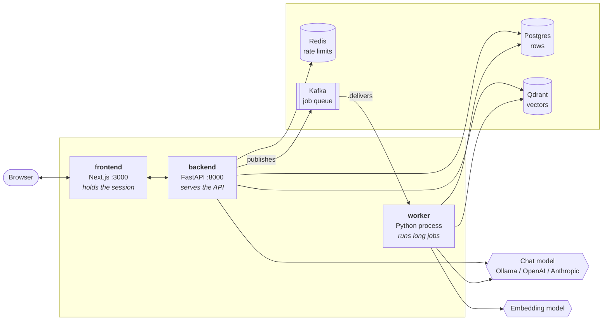
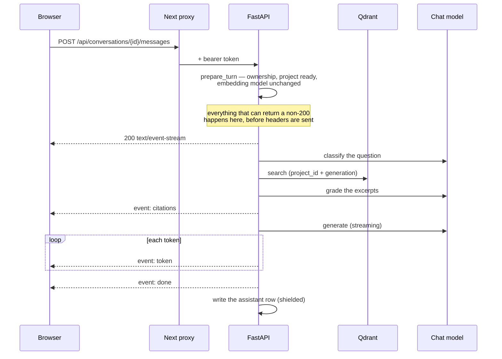
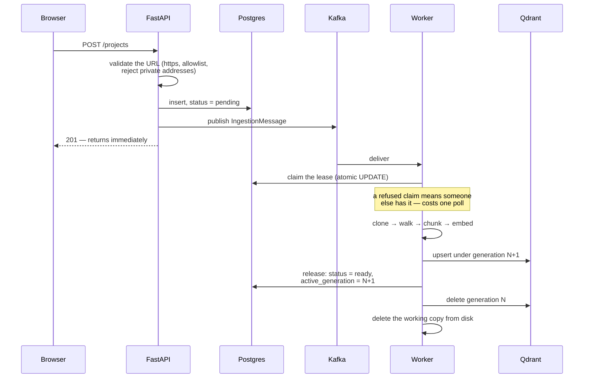

# Architecture

How the pieces fit together, and what happens on a request. Read this before
[`codebase.md`](codebase.md) — that one tells you where code lives, this one tells you why
there is more than one process.

For *what* AskRepo is and why it exists, read [`PRD.md`](PRD.md). For which milestones are
built, read [`PRD.md`](PRD.md) §6 — it is the only place that records progress.

---

## The shape

Two applications, one background worker, four datastores.



Nothing else talks to the browser. `API_URL` is read **server-side only**, so the FastAPI
service does not need to be reachable from a user's machine — under Compose it is the service
name `http://backend:8000`.

### Why a separate worker

Indexing a repository takes minutes: clone, walk, chunk, embed every chunk, write to Qdrant.
Generating a checklist takes minutes too — it is one model call per file plus a reduce. Neither
can run inside a request.

So `POST /projects` writes the row, publishes a job, and returns immediately. The worker
(`app/worker.py`) is a separate process running three Kafka consumers plus a reconcile sweep.
It is the only process that writes vectors, and it is the only process that runs a model for
generation.

The API process also holds a chat model — the answer graph runs there, because answering is
interactive and streams to the caller. **Ingestion does not use a chat model at all**; it uses
an embedding model. The worker holds both.

### Why four datastores

| Store | Holds | Read by |
| --- | --- | --- |
| **Postgres** | Every row: users, projects, conversations, checklist, mock data | API and worker, through `app/repositories/` |
| **Qdrant** | Code chunks as vectors, with the chunk text in the payload | API (query) and worker (write) |
| **Redis** | Login rate-limit counters, and nothing else | API only |
| **Kafka** | The job queue, on 12 topics | API publishes, worker consumes |

Two of these are commonly assumed wrong:

- **Redis does not back the job queue.** Kafka does. Redis holds login rate-limit counters and
  is not used for anything else. See [`PRD.md`](PRD.md) §5 for why Kafka was chosen over
  Redis + ARQ despite the extra weight.
- **Qdrant is the system of record for code content, not an index over files.** The cloned
  working copy is deleted after indexing, so there is no file on disk to re-read at query time.
  The chunk's text lives in the Qdrant payload. See [`rag.md`](rag.md).

---

## Three request lifecycles

### 1. Asking a question



The **pre-flight/stream split** is the structural point. Once SSE headers are sent the status
code is fixed at `200`, so every check that could legitimately return `403`, `404` or `409`
runs in `ConversationService.prepare_turn` *before* the `StreamingResponse` is returned.

The assistant's row is written **once, at the end**, inside a `finally` under `asyncio.shield` —
so a client that disconnects mid-answer still gets its partial reply persisted. Details in
[`langgraph.md`](langgraph.md).

### 2. Indexing a repository



**The lease is what prevents two workers indexing the same project** — not the Kafka partition
key and not the service's busy check. Kafka delivers at least once, so the same job legitimately
arrives twice; `ProjectRepository.claim` is an atomic conditional `UPDATE` and only one caller
wins.

A reindex is a **generation swap**: new vectors are written under `active_generation + 1` while
the old generation still serves queries, the project's pointer flips only on success, and the
old generation is deleted afterwards. A reindex that fails half way leaves the previous index
intact and still answering.

### 3. Generating a checklist

Same shape as indexing — publish, claim a lease, run long, release — with two differences that
matter:

- **It runs a chat model, one call per file, plus one reduce call.** That makes
  `CHECKLIST_MAP_CONCURRENCY` a billing knob when the provider is hosted, and
  `CHECKLIST_MAX_FILES_PER_JOB` (default 200) a per-run spend bound. See [`llm.md`](llm.md).
- **It writes a proposal, not rows.** Generation produces a *pending change set*; a human ticks
  which operations to accept and `POST /checklist-change-sets/{id}/apply` is the only code that
  writes `checklist_items`. See [`data.md`](data.md).

---

## The job queue

Twelve Kafka topics, in three independent ladders — ingestion, checklist, mock data:

| Ladder | Main topic | Retries | Dead letter |
| --- | --- | --- | --- |
| Ingestion | `askrepo.ingest.requested` | `.retry.1m`, `.retry.10m` | `askrepo.ingest.dlq` |
| Checklist | `askrepo.checklist.generate` | `.retry.1m`, `.retry.10m` | `askrepo.checklist.dlq` |
| Mock data | `askrepo.mock-data.generate` | `.retry.1m`, `.retry.10m` | `askrepo.mock-data.dlq` |

They are separate on purpose: a checklist generation retrying for eleven minutes must not sit in
the queue a project reindex is waiting in.

**Kafka has no delayed-delivery primitive**, so the delay is built out of topics. A failed job
is re-published to a fixed-delay retry topic, and a `RetryConsumer` on that topic holds the
partition head until the message is due rather than sleeping.

### Two patterns that look like over-engineering

**A long job pauses its partitions and keeps polling.** aiokafka measures liveness as *fetcher
idle time* — go longer than `max.poll.interval.ms` without calling `getmany` and the client
leaves the consumer group on its own. An index can run for twenty minutes. So the consumer
pauses every assigned partition and keeps polling throughout the job: each poll returns nothing
but holds the member's seat. Raising `max.poll.interval.ms` instead is not an acceptable
substitute, and there is deliberately no setting for it.

**A reconcile sweep runs every 60 seconds.** Publishing to Kafka can fail after the row is
already committed, and a worker can die holding a lease. The sweep re-publishes jobs that were
never picked up and jobs whose lease expired. It runs for all three ladders.

---

## Configuration and identity

**Configuration flows one way**: environment → `.env` → the defaults in `Settings`
(`app/config.py`). `get_settings()` is `lru_cache`d and injected with `Depends`; nothing else
reads `os.environ`. All 71 settings are documented in [`configuration.md`](configuration.md).

**Identity is resolved once, in middleware.** `AuthContextMiddleware` decodes the bearer token,
loads the user row, and puts a frozen `AuthenticatedUser` on `request.state`. Two consequences:
the user row is read on *every* authenticated request, which is what makes deactivating an
account take effect immediately; and the middleware is registered before `CORSMiddleware`, so
CORS ends up outermost and an auth rejection still carries CORS headers.

**The forced-password-change gate is structural.** While `must_change_password` is set, every
route outside `/auth` returns `403 PASSWORD_CHANGE_REQUIRED` — enforced by middleware, not by a
per-route dependency, so a route added later is covered without opting in.

**All four processes log in one format**, set by `configure_logging` in `app/core/logging.py` and
called by the API, the worker, the CLI and `alembic/env.py`:

```
2026-09-13T02:33:36.949Z INFO     api uvicorn.error: Started server process [81421]
2026-09-13T02:33:41.796Z INFO     api uvicorn.access: 127.0.0.1:62701 - "GET /health HTTP/1.1" 200
```

The timestamp is **UTC**, marked `Z`. Kafka records epoch milliseconds and every Postgres column
is `timestamptz` in UTC (`docs/PRD.md:321`), so a line correlates with both without arithmetic —
and a developer's own machine, where `make dev` interleaves the API and the worker into one
terminal, is the only place the three would otherwise disagree. The service tag after the level
is what separates those two streams. Uvicorn's own loggers are reclaimed rather than left alone,
because it installs private handlers with `propagate = False` and its lines would otherwise be
the only untimestamped ones in the process.

**Uvicorn is started with `--log-config logging.json`, and that flag is not optional.** Under
`--reload` uvicorn runs two processes, and the **reloader parent never imports the app** — so
`create_app`'s `configure_logging` call never runs there, and its lines (`Will watch for
changes`, `Started reloader process`) keep uvicorn's own untimestamped format. `logging.json`
is read when `Config` is constructed, which happens in the parent and the child alike. It does
not duplicate the format: it names `build_formatter` as its `dictConfig` factory, so there is
still one definition of what a log line looks like.

---

## Two boot-time probes that can stop the process

Both exist because the alternative is failing illegibly, minutes into a job:

1. **Embedding dimension probe** (worker). The vector width is measured by embedding a short
   string at startup, never declared in configuration. It determines the Qdrant collection name.
2. **Structured-output probe** (`app/rag/capability.py`, both processes). Every structured path
   uses LangChain's `with_structured_output`, which needs tool-calling or a JSON mode. A model
   lacking it does not degrade politely, so the process refuses to boot instead. See
   [`llm.md`](llm.md).

---

## See also

- [`data.md`](data.md) — what is in each store, and the table relationships
- [`rag.md`](rag.md) — clone → chunk → embed → retrieve, end to end
- [`llm.md`](llm.md) — how a model is chosen, called, and bounded
- [`langgraph.md`](langgraph.md) — the answer graph and the SSE contract
- [`codebase.md`](codebase.md) — the layering, and where to add code
- [`installation.md`](installation.md) — getting it running locally
- [`deployment.md`](deployment.md) — running it for a team
