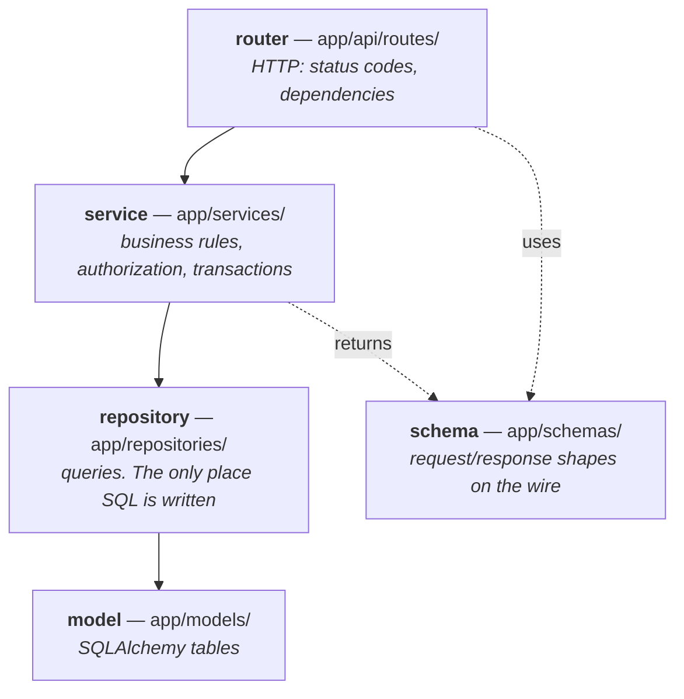

# The codebase

Where code lives, why it is layered the way it is, and where to put something new.

Read [`architecture.md`](architecture.md) first for the processes; this page is about the source
tree inside them.

---

## Backend layering

Every feature is the same four files plus a router. Data flows down, and each layer knows only
about the one below it.



### A route is thin, on purpose

```python
@router.get("", response_model=PaginatedResponse[ProjectResponse], ...)
async def list_projects(
    current_user: CurrentUser,
    service: ProjectServiceDep,
    query: Annotated[ListQuery, Query()],
) -> PaginatedResponse[ProjectResponse]:
    return await service.list(query, actor=current_user)
```

**One service call per route.** No business logic, no `if user.is_admin`, no query building. The
one exception in the whole codebase is `ask_question`, which must both run a pre-flight check
and return a streaming response — and even there, all the policy is in the service.

Authorization lives in the **service**, not the route, so `reindex` and `delete` cannot drift
apart in what they permit. Where a write needs more than membership, the service names the
permission via `access.require_permission` — reindex, delete, module create/edit/delete,
generation, change-set apply/discard, checklist item edit, result recording, and mock-data
record edit each name one. A plain list or read has no call beyond the membership scope
`resolve_project_scope` already applies. The only router-level gate is `require_admin`, and only
on `roles.py` where every route is admin-only.

### The wire boundary: `snake_case` in, `camelCase` out

Python attributes and Postgres columns are `snake_case`. Every JSON body is `camelCase`. The
translation happens in **exactly one class** — `ApiModel` in `app/schemas/base.py`, which applies
Pydantic's `to_camel` alias generator. Every request and response schema inherits it.

A schema on plain `BaseModel` silently ships `snake_case` keys. That is a defect, and
`tests/test_api_model.py` exists to catch it. It matters most for the **SSE event payloads**,
which never pass through a `response_model` — so FastAPI validates nothing about them, and the
`SSE_EVENT_MODELS` tuple that test walks is the only thing holding them to the rule.

### One error shape

Every error is `{"detail": {"code": ..., "message": ...}}`, built by `AppError`. `ErrorCode`
values are a **wire contract** — add members, never rename them. A `422` adds a `fields` map
keyed by the `camelCase` field name.

### `403` vs `404` is a security decision

- **`404`** when the caller should not learn it exists — another user's conversation, or a
  project the caller holds no membership on. Project existence is **not** public: once projects
  are not shared, "you may not see this" and "this does not exist" are the same answer, and a
  `403` would confirm a private repository exists to anyone who can guess an id.
- **`403`** when the caller may see the resource but not do this to it — a *member* whose role
  is too low to delete the project. They can already see it in their own list, so a `404` would
  contradict what the UI just rendered.

Backwards, this either leaks existence or hides something the user can already see in a list.

---

## The access resolver

This is the single most consequential constraint in the repo, and it is two functions in
`app/core/access.py`:

```python
def resolve_project_scope(user: AuthenticatedUser) -> ProjectScope:
    """Which projects this caller may read."""
    if user.is_admin:
        return ProjectScope.all()
    return ProjectScope.of(grant.project_id for grant in user.grants.values())

def require_permission(user, project_id, permission) -> None:
    """What this caller may do to one of them. Raises 404 or 403."""
```

**All read scoping goes through `resolve_project_scope`, and every gate through
`require_permission`.** A route, service or query that filters projects on its own is a defect
*even when its output is currently correct*, because it puts scoping in two places —
`tests/test_scoping_is_single_point.py` enforces that as a grep.

That discipline is what made per-project RBAC a change to one function's body rather than a
rewrite: phase 2.1 replaced the `return ProjectScope.all()` that shipped in phase 1, added
`require_permission` beside it, and touched none of the 15 call sites.

`ProjectScope` is an explicit dataclass rather than `list[UUID] | None`, because a `None`
sentinel meaning "unrestricted" is fail-open — a bug that forgets to set it hands out
everything. An empty `ids` means *no* projects, never all of them. `narrowed_to` is how an
orthogonal filter such as `?ownerless=true` applies **on top of** the resolver's answer instead
of replacing it, so the filter never becomes a second enforcement point.

The grants themselves are loaded once per request by `AuthContextMiddleware`, which is what
keeps both functions synchronous — see [`architecture.md`](architecture.md).

Its counterpart `resolve_conversation_owner` sits in the same file so the contrast is visible
rather than folklore: projects are reached through membership, conversations are private to one
user and have no admin bypass at all. The permission catalogue in `app/core/permissions.py`
deliberately contains **no `conversation.*` member**, which is what makes the admin bypass in
`require_permission` safe — there is nothing there to bypass into, and `tests/test_permissions.py`
fails if one is ever added.

**`created_by` is not ownership.** It is attribution. The RBAC migration read it once to
backfill an `owner` membership per project; after that, what a caller may do comes from their
membership's role, never from that column, and it never scopes reads.

---

## Backend tree

```
backend/app/
├── main.py            FastAPI app + lifespan (topics, probes, queue)
├── worker.py          the separate process: 3 consumers + retry ladders + reconcile sweep
├── config.py          Settings — the only place os.environ is read
├── cli.py             seed-admins and restore-system-roles; seed-admins runs from
│                      the container entrypoint
│
├── api/
│   ├── deps.py        shared dependencies (CurrentUser, AdminUser, service factories)
│   └── routes/        15 routers, 67 routes
│
├── core/              cross-cutting: access, audit, crypto, errors, grant_cache, logging,
│                      middleware, passwords, permissions, rate_limit, repo_url,
│                      role_seed, security
├── db/session.py      engine + sessionmaker
├── models/            8 modules, 17 tables
├── repositories/      15 repositories — the only place SQL is written
├── schemas/           request/response shapes, all on ApiModel
├── services/          15 services — business rules and authorization,
│                      plus path_tree.py: pure tree shaping, no I/O
│
├── ingestion/         cloner, walker, chunker, embedder/, vector_store, pipeline
├── queue/             topics, producer, consumer, retry, protocol, checklist, mock_data
├── rag/               retriever, chat, prompts, answerer, grounding, capability, errors
│   └── graph/         build.py, nodes.py, state.py
├── checklist/         generator, model_output, operations, source
└── mockdata/          generator, model_output, operations
```

### The RBAC modules

Per-project access is spread across the same layers as any other feature, plus three modules in
`core/` that have no equivalent elsewhere:

| Module | Holds |
| --- | --- |
| `core/permissions.py` | `Permission` — the source of truth for which permissions exist — the groups the role-matrix UI renders, and the viewer/editor/owner permission sets |
| `core/role_seed.py` | `ensure_system_roles`, reconciling the three system roles to those sets. One implementation, called by the migration, the test harness, and `cli.py restore-system-roles` |
| `core/grant_cache.py` | The Redis read-through cache for a user's grants, with epoch and per-user invalidation |
| `models/membership.py` | `Role`, `RolePermission`, `ProjectMembership` |
| `repositories/role.py`, `repositories/membership.py` | Their queries, including `load_grants` (the middleware's hot path), `ownerless_project_ids` and `projects_solely_owned_by` |
| `services/role.py`, `services/membership.py` | Role CRUD with system-role immutability; granting, changing and revoking membership |
| `api/routes/roles.py`, `api/routes/members.py` | `/roles` + `/permissions` (admin-only, gated at the router) and `/projects/{id}/members` |

Every service write that changes who may reach what **evicts the grant cache after the commit** —
a role-definition change bumps the epoch, a membership change deletes that user's key.

### Reading order for a newcomer

1. `config.py` — what is configurable
2. `models/project.py` — the richest table, and the lease/generation columns
3. `api/routes/projects.py` → `services/project.py` → `repositories/project.py` — one feature
   through all four layers
4. `core/access.py` + `core/permissions.py` — who may see what, and what they may do
5. `ingestion/pipeline.py` — the write path end to end
6. `rag/graph/build.py` — the answer graph in one screen

---

## Frontend layering

Next.js App Router, and **not a thin client**.

```
frontend/
├── app/
│   ├── (auth)/          login, change-password
│   ├── (app)/           dashboard, projects, ask, checklist,
│   │                    settings (users, roles)
│   └── api/
│       ├── [...path]/   the one route the browser talks to — proxies everything
│       └── auth/        login, logout, refresh — the only handlers that write cookies
├── components/
│   ├── ui/              shadcn on the Base UI base (30 components)
│   ├── ask/ checklist/ mock-data/ projects/ roles/ users/   feature components
│   ├── form/ feedback/ layout/                       shared shells
├── hooks/               React Query hooks
├── lib/                 api client, query keys, SSE parser, auth/session
└── proxy.ts             route protection + refresh on navigation
```

Each screen is a thin `page.tsx` (a Server Component) plus a `*-screen.tsx` client component.

### Next holds the session

No token is ever readable by a script on the page.

- **Two cookies, both httpOnly, both `Path=/`**: `askrepo_access` (the JWT) and `askrepo_session`
  (the backend's refresh cookie, stored verbatim). `Path=/` differs from the backend's `/auth`
  scope on purpose — `proxy.ts` runs at `/projects` and is only sent cookies whose path matches.
- **`app/api/[...path]/route.ts` is the only route the browser calls.** It attaches the bearer,
  strips `set-cookie` from every backend response, and relays the body untouched.
- **Refresh happens in two places, and that split is structural.** A Server Component cannot set
  a cookie, so a token refreshed during render could never be persisted. Navigations refresh in
  `proxy.ts`; browser fetches and the answer stream refresh inside the API proxy, on the `401`
  status line, *before any body is read* — which is what keeps it safe on the SSE route.
- **`API_URL` is server-only.** There are no `NEXT_PUBLIC_*` variables; re-adding the prefix
  would inline the value into the client bundle.

### Styling

Tailwind CSS 4, CSS-first `@theme` — there is no `tailwind.config.js` for tokens.

- **Never write a `dark:` colour utility.** The token already knows what dark means. `bg-card`,
  not `bg-white dark:bg-slate-900`.
- **Never use a palette utility.** `bg-zinc-50` names a colour, not a role, so it does not follow
  the theme. Use `bg-card`, `text-muted-foreground`, `border-border`.
- `frontend/app/globals.css` is the only file allowed to contain a raw hex colour.
- Composition uses **`render={<Component />}`, never `asChild`** — `asChild` does not exist on
  the Base UI base and fails silently.

Full reference: [`design.md`](design.md).

---

## Where does X go?

| I want to… | Do this |
| --- | --- |
| **Add a route to an existing resource** | Schema in `app/schemas/`, method on the service, thin route. Update `backend/README.md`'s route table |
| **Add a whole new resource** | Run `/scaffold-route` — it generates schema, model, migration, repository, service and router to the repo's conventions |
| **Add a setting** | `app/config.py`, `backend/.env.example`, **and** `docs/configuration.md` — all three in the same change |
| **Change a table** | Model, then `uv run alembic revision --autogenerate`, then **read** what it generated. See [`data.md`](data.md) |
| **Change how retrieval works** | `app/rag/retriever.py`. Both filters are mandatory — see [`rag.md`](rag.md) |
| **Change a prompt** | `app/rag/prompts.py`, then run `uv run pytest -m model`. No ordinary test can catch a bad prompt |
| **Add a graph node** | `app/rag/graph/nodes.py` + wire it in `build.py`. It must degrade, never block. Test it with the `run_node` harness |
| **Add a background job** | A topic trio in `app/queue/topics.py`, a handler, a consumer in `worker.py`, and a lease on the row |
| **Add a screen** | `page.tsx` + `*-screen.tsx`, a hook in `hooks/`, nav entry per [`design.md`](design.md) |
| **Add a UI component** | `npx shadcn@latest add <name>` into `components/ui/`. Do not hand-write one that shadcn ships |

---

## Conventions enforced by lint, not review

`backend/pyproject.toml` selects `ANN` (type-hint coverage), `T20` (bans `print()`), `LOG`/`G`
(logging correctness), `RUF`, plus `E`/`F`/`I`/`UP`/`B`. `# noqa` and `# type: ignore` need a
reason on the same line.

If you add a convention, wire it into the config in the same change — a rule lint can enforce
should be enforced there.

Run everything CI runs with `make check`: ruff, prettier, mypy, pytest, vitest.

---

## The rule files

`.claude/rules/` holds 13 rule files that encode conventions this page only summarises —
`router.md`, `persistence.md`, `response-api.md`, `rag.md`, `ingestion.md`, `design-system.md`,
`forms.md`, `navigation.md`, `frontend-bff.md`, and others. They are written for coding agents
but are the most precise statement of each convention, and worth reading before a change in the
area they cover.

Two apply to everything: `contradiction-halt.md` (if a request contradicts the PRD or a rule,
report it rather than working around it) and `documentation.md` (if your change makes a doc
wrong, fixing it is part of the same change).

---

## See also

- [`architecture.md`](architecture.md) — the processes and their lifecycles
- [`data.md`](data.md) — tables, leases, soft delete
- [`rag.md`](rag.md) · [`llm.md`](llm.md) · [`langgraph.md`](langgraph.md) — the AI path
- [`configuration.md`](configuration.md) — every setting
- [`../backend/README.md`](../backend/README.md) — the exhaustive route table
- [`../frontend/README.md`](../frontend/README.md) — frontend scripts and env
