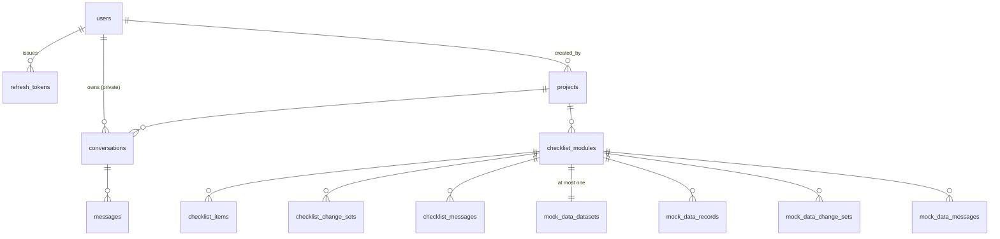
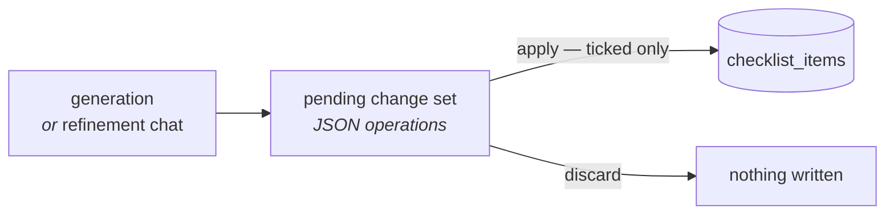

# How data is stored

Four stores, and each holds exactly one kind of thing. This page says what is in each, how the
Postgres tables relate, and the three storage rules that are easy to break.

Read [`architecture.md`](architecture.md) first for why there are four.

---

## What lives where

| Store | Holds | Survives a restart? |
| --- | --- | --- |
| **Postgres** | 13 tables — every row the app owns | Yes, and it is the only thing you must back up besides the PAT key |
| **Qdrant** | Code chunks as vectors, **with the chunk text in the payload** | Yes, but it is rebuildable by re-indexing |
| **Redis** | Login rate-limit counters | No, and that is fine — losing them resets a lockout |
| **Kafka** | Job messages on 12 topics | Yes, but the reconcile sweep recovers anything lost |
| **Disk** (`/data/repos`) | The cloned working copy, **deleted after indexing** | No. It is scratch space, not a volume to preserve |

Two of these are commonly assumed wrong. **Redis is not the job queue** — Kafka is; Redis backs
login rate limiting and nothing else. And **Qdrant is the system of record for code content**,
not an index over files: the working copy is deleted after indexing, so there is no file to
re-read at query time.

---

## The Postgres tables

Thirteen tables in five groups. Every one of them except `refresh_tokens` and `messages` carries
`created_at`, `updated_at` and `deleted_at`.



### Accounts

| Table | Notable columns |
| --- | --- |
| `users` | `email` (partial unique index where not deleted), `password_hash`, `is_admin`, `must_change_password`, `last_login_at` |
| `refresh_tokens` | `token_hash`, `family_id`, `issued_at`, `expires_at`, `used_at`, `revoked_at`, `revoked_reason` |

Refresh tokens are **opaque and stored hashed**, so they can be revoked and so the database
never holds a usable credential. They **rotate on use**: `used_at` marks the spent one and
`family_id` ties a chain together, which is what makes replay of an already-used token
detectable. Access tokens are stateless JWTs (15 minutes) and are not stored at all.

There is no public registration, no email verification and no self-service reset — an admin
creates accounts, and `must_change_password` forces a change on first login. That is why there
is **no mail provider anywhere in the stack**.

### Projects

`projects` carries four groups of columns beyond the obvious:

| Group | Columns | Why |
| --- | --- | --- |
| Ingest result | `status`, `error`, `last_indexed_commit`, `file_count`, `chunk_count` | What the last run produced |
| Lease | `lease_owner`, `lease_expires_at`, `last_job_id` | The deduplication boundary — see below |
| Generation | `active_generation`, `reindex_in_progress` | Which vector generation is being served |
| Embedding provenance | `embedding_collection`, `embedding_model` | Which Qdrant collection this project's points are in |
| Credential | `encrypted_pat` | Encrypted at rest with `PAT_ENCRYPTION_KEY` |

`embedding_collection` is recorded rather than recomputed. A project indexed before a provider
switch legitimately lives in a different collection from the one current settings would name,
and this column is how `DELETE /projects/{id}` knows where its points are.

### Conversations

`conversations` are **private to their owner** — the one thing in the app that is not shared.
`messages` holds the turns, with `citations` as JSON, plus `model` and `finish_reason` recorded
per assistant row.

`messages` has no `deleted_at`: it is reachable only through its conversation, so soft-deleting
the conversation is enough.

### QA Checklist

| Table | Holds |
| --- | --- |
| `checklist_modules` | The named module, its `source_path`, status, lease, and `indexed_generation` |
| `checklist_items` | The test cases: `feature`, `test_name`, `expected_result`, `status`, `current_result`, `notes`, `citations`, `position` |
| `checklist_change_sets` | A **proposal**: `operations` as JSON, `summary`, `origin`, `status` |
| `checklist_messages` | The module's shared refinement chat |

`indexed_generation` records which project generation the last run read. When it falls behind
`projects.active_generation`, the module reports `stale` — the repository has been re-indexed
since the checklist was generated.

### Mock data

`mock_data_datasets`, `mock_data_records`, `mock_data_change_sets`, `mock_data_messages` mirror
the checklist's four exactly, keyed by `checklist_module_id`. They are deliberately **separate
tables with their own status and lease**, so a mock-data generation failing does not mark the
checklist failed, and one lease does not block the other.

---

## Three storage rules

### 1. Postgres rows soft-delete; the matching Qdrant points hard-delete

Every table carries `deleted_at` and every query filters `deleted_at IS NULL`. Vector points
have no such column, and a query-time filter would be one forgotten call away from serving
deleted content.

So deleting a project soft-deletes the row **and hard-deletes its points, in the same
operation** — and the vector delete runs *before* the commit, so if Qdrant refuses, the row
stays visible rather than becoming a soft-deleted project whose content is still queryable.

Deleting a project also sweeps its conversations, checklist and mock data. Not scoped by owner:
the project was shared, so the conversations belong to several people and all of them go.

### 2. The lease is the deduplication boundary

Kafka delivers at least once, so the same job legitimately arrives twice — a consumer group
rebalance, a redelivered uncommitted offset, a reconcile sweep racing a retry.

**What stops two workers running the same job is a database lease**, not the offset and not the
partition key. `claim` is an atomic conditional `UPDATE`:

```sql
UPDATE projects SET lease_owner = :worker, lease_expires_at = :expiry, last_job_id = :job
WHERE id = :id
  AND deleted_at IS NULL
  AND last_job_id IS DISTINCT FROM :job     -- not a redelivery of a finished job
  AND (lease_expires_at IS NULL OR lease_expires_at < now())   -- nobody holds it
```

Exactly one caller gets `rowcount == 1`. A duplicate delivery costs one refused claim, which is
why the consumer can safely absorb an error and leave the offset uncommitted.

The service-level "is it already running?" check is a **fast path for a nicer API response**,
not a correctness boundary — two simultaneous callers both pass it. Removing the lease because
"the service already checks" is a defect.

A worker that dies holding a lease is recovered when the lease expires: the reconcile sweep
re-publishes it.

### 3. A proposal is not a row

Neither a generated checklist nor a generated mock dataset lands as rows. Both producers — the
background generator and the refinement chat — write a **pending change set**: a JSON list of
`add` / `update` / `remove` operations, each with the rationale that argued for it. A human
ticks the ones they accept, and `apply` writes exactly those. Discarding writes nothing.



Two consequences that are not visible from any single file:

- **A regeneration cannot destroy a recorded result.** It proposes operations against the rows
  that exist, so a `pass` a tester recorded last week survives unless somebody ticks a `remove`
  and applies it.
- **`status` and `current_result` are outside what an operation may write.** The apply path runs
  an explicit column allowlist rather than `setattr`, because `operations` originates in a
  model's output and an unchecked key would let it claim an observation nobody made.

There is **one pending change set per module** at a time, deliberately: concurrent refinement is
out of scope, and the UI disables Generate and the composer while one is waiting rather than
letting a second request fail with a `409` after the user typed a paragraph.

---

## What Qdrant holds

One collection per embedding provider/model/width, named
`code_chunks__{provider}__{model}__{dimensions}`. Each point carries:

```json
{
  "project_id": "…", "generation": 3,
  "file_path": "app/auth/login.py", "start_line": 1, "end_line": 40,
  "language": "python", "symbol": "login", "chunk_index": 0,
  "commit_sha": "abc123", "content": "def login(user): …"
}
```

`project_id` and `generation` both have payload indexes — without them, filtering degrades to a
scan as the collection grows. The point id embeds the generation, so a reindex writes *new*
points rather than overwriting the ones still serving queries.

Full detail in [`rag.md`](rag.md).

---

## Migrations

Alembic, in `backend/alembic/versions/` — 8 revisions. Run them with `make migrate` (or
`uv run alembic upgrade head` from `backend/`). The production entrypoint chains
`alembic upgrade head && python -m app.cli seed-admins && uvicorn …`, so a deploy migrates
before it serves.

A model change without a migration is a defect. Generate one with
`uv run alembic revision --autogenerate -m "…"` and **read what it produced** — autogenerate
misses server defaults, index renames and enum changes.

---

## See also

- [`rag.md`](rag.md) — how chunks get into Qdrant and back out
- [`architecture.md`](architecture.md) — the processes that read these stores
- [`configuration.md`](configuration.md) — connection settings for all four
- [`deployment.md`](deployment.md) — backing up Postgres and the PAT key
- [`PRD.md`](PRD.md) §4 — the schemas as specified, which outrank this page
