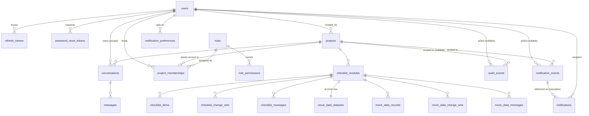
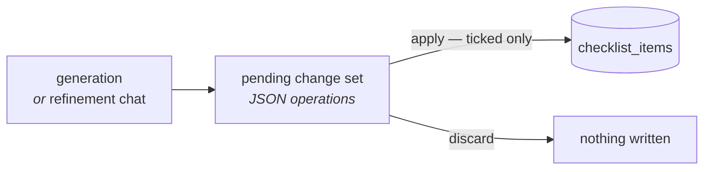

# How data is stored

Four stores, and each holds exactly one kind of thing. This page says what is in each, how the
Postgres tables relate, and the three storage rules that are easy to break.

Read [`architecture.md`](architecture.md) first for why there are four.

---

## What lives where

| Store | Holds | Survives a restart? |
| --- | --- | --- |
| **Postgres** | 20 tables — every row the app owns | Yes, and it is the only thing you must back up besides the PAT key |
| **Qdrant** | Code chunks as vectors, **with the chunk text in the payload** | Yes, but it is rebuildable by re-indexing |
| **Redis** | Login rate-limit counters, and the per-user grant cache | No, and that is fine — a lost lockout resets, and a lost grant snapshot is re-read from Postgres |
| **Kafka** | Job messages on 12 topics | Yes, but the reconcile sweep recovers anything lost |
| **Disk** (`/data/repos`) | The cloned working copy, **deleted after indexing** | No. It is scratch space, not a volume to preserve |

Two of these are commonly assumed wrong. **Redis is not the job queue** — Kafka is; it holds
login rate-limit counters and a cache of each user's project grants, and nothing else. Neither
is authoritative: the grant cache is a copy of `project_memberships`, so a Redis outage
degrades to a Postgres query rather than to a denial (see [Grants in Redis](#grants-in-redis)).
And **Qdrant is the system of record for code content**, not an index over files: the working
copy is deleted after indexing, so there is no file to re-read at query time.

---

## The Postgres tables

Twenty-one tables in eight groups. Every one of them except `refresh_tokens`, `password_reset_tokens`, `messages`,
`audit_events`, `notification_events` and `notifications` carries `created_at`, `updated_at` and
`deleted_at`.

`audit_events` is the sharp exception, and **its omissions are the append-only mechanism rather
than an oversight**. It carries `created_at` and neither of the other two. No `deleted_at`, so
there is no soft-delete path to reach these rows through at all — `BaseRepository.active_select()`
filters only when the model carries `SoftDeleteMixin`, so append-only stops being a convention
every future repository method has to respect and becomes a property of the model. No
`updated_at`, because a column recording a mutation has no business on a row that is never
mutated. See [Audit](#audit).

`notification_events` and `notifications` carry neither mixin either, for two of the same three
reasons — and deliberately **not** the third. See [Notifications](#notifications).



### Accounts

| Table | Notable columns |
| --- | --- |
| `users` | `email` (partial unique index where not deleted), `password_hash`, `is_admin`, `must_change_password`, `last_login_at` |
| `refresh_tokens` | `token_hash`, `family_id`, `issued_at`, `expires_at`, `used_at`, `revoked_at`, `revoked_reason` |
| `password_reset_tokens` | `id`, `user_id`, `token_hash`, `created_at`, `expires_at`, `used_at`, `revoked_at`, `sent_at` (hard-deleted if expired or used > 24h ago) |

Refresh tokens are **opaque and stored hashed**, so they can be revoked and so the database
never holds a usable credential. They **rotate on use**: `used_at` marks the spent one and
`family_id` ties a chain together, which is what makes replay of an already-used token
detectable. Access tokens are stateless JWTs (15 minutes) and are not stored at all.

Password reset tokens (Phase 2.4) are **also stored hashed and single-use**. The raw token
never reaches Postgres — only a hashed version — and rides to the user in an email link
fragment. `used_at` is stamped once the password is reset; `revoked_at` is stamped on every
other live token for a user the moment a new one is minted, so an earlier email's link stops
working; `sent_at` is stamped only if the one send attempt succeeds. Hard-deleted by the worker
for expired tokens or those used more than 24 hours ago — the same reasoning as
`refresh_tokens`: a dead token is not a record anyone needs to keep, and `deleted_at` would only
keep a hash around for longer with nothing reading it.

There is no public registration and no email verification. Admin-provisioned accounts carry
`must_change_password` set, which forces a change on first login. Self-service password reset
is optional (Phase 2.4, `MAIL_ENABLED`); when off, only admins can reset a password.

### Access

| Table | Notable columns |
| --- | --- |
| `roles` | `name` (partial unique index where not deleted), `description`, `is_system` |
| `role_permissions` | `role_id`, `permission` — one row per permission a role carries, unique per `(role_id, permission)` where not deleted |
| `project_memberships` | `user_id`, `project_id`, `role_id`, `granted_by` — unique per `(user_id, project_id)` where not deleted |

A **role is an instance-wide definition; the assignment carries the project.** That separation
is what lets one "QA Lead" role be granted on twelve projects without twelve role rows.
`is_system` marks `viewer`, `editor` and `owner`, which cannot be renamed, deleted or
re-permissioned — without that immutability, unchecking `membership.grant` on `owner` would
leave nobody on the instance able to grant membership, including to undo it.

`role_permissions.permission` is a **validated string, not a foreign key.** Which permissions
exist is anchored in `app/core/permissions.py`, because if existence lived in a table then
deleting a row would make every check site ask for something that does not exist — and the
fail-safe answer, deny, would let one `DELETE` brick project deletion instance-wide.

`granted_by` is nullable, and `NULL` means nobody granted it: the memberships the RBAC
migration derived from `projects.created_by` carry no granter, and fabricating one would
record a lie in the one table whose purpose is being trustworthy.

**Every unique index in this group is partial on `deleted_at IS NULL`** — the same soft-delete
pattern as `users.email`, and for a sharper reason here. Revoking a membership soft-deletes the
row, so without the `WHERE` clause, re-granting access to someone previously revoked would
collide on a row nobody can see, with an error naming a constraint the admin cannot observe.
`project_memberships` also carries non-unique partial indexes on `user_id` and `project_id`;
the `user_id` one is on the hot path, read on every authenticated request.

The RBAC migration (`58f7e042f75a`) seeds the three system roles and backfills one `owner`
membership per live project from `created_by`. It **does not fabricate owners for deactivated
creators**: it seeds `created_by` unconditionally, so a project whose creator was already
soft-deleted starts with no live owner. Those projects stay operable — admins bypass every
project permission — and `GET /projects?ownerless=true` lists them for an admin to fix.

### Projects

`projects` carries four groups of columns beyond the obvious:

| Group | Columns | Why |
| --- | --- | --- |
| Ingest result | `status`, `error`, `last_indexed_commit`, `file_count`, `chunk_count` | What the last run produced |
| Lease | `lease_owner`, `lease_expires_at`, `last_job_id` | The deduplication boundary — see below |
| Generation | `active_generation`, `reindex_in_progress` | Which vector generation is being served |
| Embedding provenance | `embedding_collection`, `embedding_model` | Which Qdrant collection this project's points are in |
| Credential | `encrypted_pat` | Encrypted at rest with `PAT_ENCRYPTION_KEY` |

`embedding_collection` is recorded rather than recomputed. A project indexed before a provider
switch legitimately lives in a different collection from the one current settings would name,
and this column is how `DELETE /projects/{id}` knows where its points are.

### Conversations

`conversations` are **private to their owner** — the one thing in the app that is not shared.
`messages` holds the turns, with `citations` as JSON, plus `model` and `finish_reason` recorded
per assistant row.

`messages` has no `deleted_at`: it is reachable only through its conversation, so soft-deleting
the conversation is enough.

### QA Checklist

| Table | Holds |
| --- | --- |
| `checklist_modules` | The named module, its `source_path`, status, lease, and `indexed_generation` |
| `checklist_items` | The test cases: `feature`, `test_name`, `expected_result`, `status`, `current_result`, `notes`, `citations`, `position` |
| `checklist_change_sets` | A **proposal**: `operations` as JSON, `summary`, `origin`, `status` |
| `checklist_messages` | The module's shared refinement chat |

`indexed_generation` records which project generation the last run read. When it falls behind
`projects.active_generation`, the module reports `stale` — the repository has been re-indexed
since the checklist was generated.

### Mock data

`mock_data_datasets`, `mock_data_records`, `mock_data_change_sets`, `mock_data_messages` mirror
the checklist's four exactly, keyed by `checklist_module_id`. They are deliberately **separate
tables with their own status and lease**, so a mock-data generation failing does not mark the
checklist failed, and one lease does not block the other.

### Audit

`audit_events` is one row per thing somebody did. It is the only table outside both mixins, for
the reason stated above — that is what makes it append-only.

| Column | Holds |
| --- | --- |
| `event_type`, `outcome` | The catalogue name (`project.deleted`, `auth.login.failed`, …) and `success` / `failure` |
| `actor_user_id`, `actor_email` | Who. **`NULL` means no authenticated actor** — a failed login against an address that matches no live user, or the `seed-admins` CLI. `actor_email` is a snapshot, not a join: `users.email` is unique only where not deleted, so resolving at read time would eventually attribute an old event to a new person |
| `target_type`, `target_id`, `target_label` | What it was done to. `target_id` is deliberately **not** a foreign key — the row it points at may be gone, and an FK would either block the delete or cascade away the record of it. `target_label` is the core of the feature: a deleted project takes its name with it, so "who deleted it" is only answerable if this row already holds *what* was deleted |
| `project_id` | Which project it happened under, where one applies |
| `ip_address` | The caller's address, which is what still shows a brute-force pattern when the actor is `NULL`. Resolved by `rate_limit.client_ip` — the same function the login limiter keys on, so the two cannot disagree — from the `X-Forwarded-For` the frontend relays, or the socket peer when `TRUSTED_PROXY_HOPS` is `0` |
| `details` | The JSONB payload, capped at 8 KB |

Four non-partial indexes — `created_at`, `actor_user_id`, `event_type`, `project_id`. None of
them is partial because there is no `deleted_at` to filter, which is the one place this table
diverges from every other group above.

**The catalogue is a `StrEnum` in `app/core/audit.py`, not a table** — 39 event types across auth,
accounts, projects, RBAC, password reset, checklist modules and items, change sets, mock data, exports and
conversations. Existence lives in code for the reason `app/core/permissions.py` gives for the
permission catalogue: if it lived in a table, deleting a row would orphan every write site that
names it. Which operations must record one is a rule rather than a list —
`.claude/rules/audit-trail.md`, enforced in both directions by
`backend/tests/test_audit_coverage.py`.

**Two things are never stored here**: the secret (no passwords, tokens or PATs — a `repo_url` is
reduced to its host by `urlsplit().hostname`, which excludes the userinfo a PAT rides in) and the
content (no prompt, no message, no source excerpt, and **`target_label` is `NULL` for a
conversation**, because its title derives from the user's first question).

**`details` is one envelope** for all 39 events:

```json
{
  "changed": { "name": { "before": "billing-api", "after": null } },
  "patSupplied": true
}
```

`changed` holds only fields that actually changed — a create writes `"before": null` throughout, a
delete writes `"after": null` — and **which fields may appear is an allowlist per event type**,
never a diff of the model's dirty attributes. A generic differ would start writing `password_hash`
and `encrypted_pat` the moment somebody adds a column; with the allowlist, a new column is
invisible to the trail until someone names it, which is the correct failure direction. Flat keys
beside `changed` carry immutable context that is not a change (`patSupplied`, `forced`,
`unknownAccount`, `format`, counts). Keys are `camelCase` **as stored**, so the stored bytes match
the wire.

**One delete path, and it takes a cutoff and nothing else.**
`AuditEventRepository.delete_older_than(cutoff)` is a hard delete driven by
`AUDIT_RETENTION_DAYS` (default `0` — keep forever) from the worker's existing 60-second tick. No
actor filter, no event-type filter: an operator sets a window, nobody erases a row. There is no
`update` method and no route that writes — the router is `GET /audit-events` and
`GET /audit-events/{id}`, admin-only, which is how append-only shows up on the wire and not only
in the schema.

The write itself happens **after the commit that made the change true**, on the recorder's own
session, and `AuditRecorder.record` never raises — see
[`architecture.md`](architecture.md#the-audit-write-path).

### Notifications

Three tables. `docs/PRD.md` §2.1, Phase 2.3; mechanism in `.claude/rules/notifications.md`.

| Table | One row per | Notes |
| --- | --- | --- |
| `notification_events` | occurrence | `event_type`, nullable `actor_user_id`, not-null `project_id`, nullable `target_type`/`target_id` (not an FK — same reasoning as `audit_events.target_id`), a per-event `details` JSONB allowlist |
| `notifications` | `(event, recipient)` | `event_id` FK **`ON DELETE CASCADE`**, `user_id`, `in_app_visible` (the preference snapshot), `read_at`. `UNIQUE (event_id, user_id)` is the deduplication boundary. `email_state`, `email_attempts`, `email_claimed_until`, `email_sent_at` — added in Phase 2.4. Only `email_state` is written at fan-out, off a separate preference lookup made at the same moment as `in_app_visible`'s (`_muted_for` for in-app, `muted_email` for email, in `NotificationFanout._write`): `'pending'` when mail is on and the recipient's email preference is on, `NULL` when email was never in play. `sent`/`failed`/`skipped` are delivery outcomes the outbox writes later, not part of the fan-out snapshot. A partial index, `ix_notifications_email_pending` on `(created_at) WHERE email_state = 'pending'`, is what the outbox claims against — distinct from `ix_notifications_unread`, the existing partial index the polled unread count reads |
| `notification_preferences` | `(user, event_type)` a user has an opinion about | `in_app`, `email` — both default `true`. Sparse: **absence means on**, so a new event type is on for everybody with no backfill |

`notification_events` carries neither `TimestampMixin` nor `SoftDeleteMixin`, for two of
`audit_events`' three reasons and **not the third**: no `updated_at`, because an occurrence is
never mutated; no `deleted_at`, because nobody soft-deletes a notification and
`active_select()` would be filtering a column that is always `NULL`. **Unlike `audit_events`,
this table is not append-only** — retention hard-deletes past `NOTIFICATION_RETENTION_DAYS`
(default `90`), and the `ON DELETE CASCADE` on `notifications.event_id` takes each event's
per-recipient rows with it in the same statement. `audit_events` is append-only because it is
the record; a notification is a nudge with a shelf life, and claiming append-only for a table
retention prunes every 60 seconds would be a guarantee this table does not hold.

`notifications` carries no soft delete either: a user marks a row read, they do not delete it,
and retention is the only remover — by age, never by request. A partial index on `user_id`
`WHERE read_at IS NULL AND in_app_visible` is what the polled unread count reads; nothing else.

`notification_preferences` is the one table of the three that **does** carry `TimestampMixin` (a
preference is mutated) and does **not** carry `SoftDeleteMixin` (a preference is upserted, never
deleted).

Recipients resolve through `resolve_notification_recipients` in `app/core/access.py` — the same
file that answers every other "who may see this" question — never a query built at a fan-out
call site. The write itself happens **before** the commit that makes the underlying change true,
the opposite ordering from the audit write above, because a lost notification is the feature not
working rather than an accepted, logged gap. See `.claude/rules/notifications.md` and
[`architecture.md`](architecture.md#the-notification-fan-out-path).

---

## Three storage rules

### 1. Postgres rows soft-delete; the matching Qdrant points hard-delete

Every table that can be deleted from carries `deleted_at`, and every query filters
`deleted_at IS NULL`. Two exceptions: `audit_events` (nothing deletes except the retention
cutoff) and `password_reset_tokens` (tokens are hard-deleted by the worker when expired or used
more than 24 hours ago). Vector points have no such column either, and a query-time filter would
be one forgotten call away from serving deleted content.

So deleting a project soft-deletes the row **and hard-deletes its points, in the same
operation** — and the vector delete runs *before* the commit, so if Qdrant refuses, the row
stays visible rather than becoming a soft-deleted project whose content is still queryable.

Deleting a project also sweeps its conversations, checklist and mock data. Not scoped by owner:
a project has members, so the conversations belong to several people and all of them go.

### 2. The lease is the deduplication boundary

Kafka delivers at least once, so the same job legitimately arrives twice — a consumer group
rebalance, a redelivered uncommitted offset, a reconcile sweep racing a retry.

**What stops two workers running the same job is a database lease**, not the offset and not the
partition key. `claim` is an atomic conditional `UPDATE`:

```sql
UPDATE projects SET lease_owner = :worker, lease_expires_at = :expiry, last_job_id = :job
WHERE id = :id
  AND deleted_at IS NULL
  AND last_job_id IS DISTINCT FROM :job     -- not a redelivery of a finished job
  AND (lease_expires_at IS NULL OR lease_expires_at < now())   -- nobody holds it
```

Exactly one caller gets `rowcount == 1`. A duplicate delivery costs one refused claim, which is
why the consumer can safely absorb an error and leave the offset uncommitted.

The service-level "is it already running?" check is a **fast path for a nicer API response**,
not a correctness boundary — two simultaneous callers both pass it. Removing the lease because
"the service already checks" is a defect.

A worker that dies holding a lease is recovered when the lease expires: the reconcile sweep
re-publishes it.

### 3. A proposal is not a row

Neither a generated checklist nor a generated mock dataset lands as rows. Both producers — the
background generator and the refinement chat — write a **pending change set**: a JSON list of
`add` / `update` / `remove` operations, each with the rationale that argued for it. A human
ticks the ones they accept, and `apply` writes exactly those. Discarding writes nothing.



Two consequences that are not visible from any single file:

- **A regeneration cannot destroy a recorded result.** It proposes operations against the rows
  that exist, so a `pass` a tester recorded last week survives unless somebody ticks a `remove`
  and applies it.
- **`status` and `current_result` are outside what an operation may write.** The apply path runs
  an explicit column allowlist rather than `setattr`, because `operations` originates in a
  model's output and an unchecked key would let it claim an observation nobody made.

There is **one pending change set per module** at a time, deliberately: concurrent refinement is
out of scope, and the UI disables Generate and the composer while one is waiting rather than
letting a second request fail with a `409` after the user typed a paragraph.

---

## What Qdrant holds

One collection per embedding provider/model/width, named
`code_chunks__{provider}__{model}__{dimensions}`. Each point carries:

```json
{
  "project_id": "…", "generation": 3,
  "file_path": "app/auth/login.py", "start_line": 1, "end_line": 40,
  "language": "python", "symbol": "login", "chunk_index": 0,
  "commit_sha": "abc123", "content": "def login(user): …"
}
```

`project_id`, `generation` and `file_path` all have payload indexes — without them, filtering
degrades to a scan as the collection grows. The point id embeds the generation, so a reindex
writes *new* points rather than overwriting the ones still serving queries.

**`content` is why the reads differ.** Three of them exist — similarity search, the generation
scroll, and the path picker's enumeration — and only the first two want the whole payload. The
picker asks for `file_path` alone, because fetching all of it would ship every indexed byte of
a repository to build a list of filenames.

Full detail in [`rag.md`](rag.md).

---

## Grants in Redis

`AuthContextMiddleware` needs every project a caller may reach, on every authenticated request.
That is a three-table join, so `app/core/grant_cache.py` caches the answer in Redis under
`askrepo:perm:v1:{epoch}:user:{id}`, with a TTL of `GRANT_CACHE_TTL_SECONDS` (300 by default).

**The cache is a copy, not the truth**, and its failure behaviour differs from the other Redis
reader on purpose:

| Client | On a Redis error | Why |
| --- | --- | --- |
| `app/core/rate_limit.py` | Skip the check | Redis holds the only copy. Failing closed would deny every login |
| `app/core/grant_cache.py` | Query Postgres instead | The authoritative answer is one join away |

Neither fails closed by denying, and only one degrades by skipping a control. A permission
cache must never do that, and never has to.

**Invalidation is two mechanisms, because the blast radii differ.** A membership change affects
one user, so that user's key is deleted — *after* the transaction commits, since evicting before
it can repopulate the cache with the pre-write value and leave it there for the whole TTL. A
role's permission set changing affects every holder, which is not knowable from the write
without a reverse lookup, so the epoch in the key is incremented instead: every existing key
becomes unreachable at once, atomically, with no partial-failure mode and no user missed.
Orphaned keys expire on their TTL. That TTL is therefore a **backstop, not the mechanism** — an
invalidation that Redis dropped is corrected within five minutes rather than never.

**The user row is not cached.** `docs/PRD.md:101` requires deactivation to end sessions
immediately, and the middleware reads that row from Postgres on every request to deliver it.

---

## Migrations

Alembic, in `backend/alembic/versions/` — 10 revisions. Run them with `make migrate` (or
`uv run alembic upgrade head` from `backend/`). The production entrypoint chains
`alembic upgrade head && python -m app.cli seed-admins && uvicorn …`, so a deploy migrates
before it serves.

A model change without a migration is a defect. Generate one with
`uv run alembic revision --autogenerate -m "…"` and **read what it produced** — autogenerate
misses server defaults, index renames and enum changes.

---

## See also

- [`rag.md`](rag.md) — how chunks get into Qdrant and back out
- [`architecture.md`](architecture.md) — the processes that read these stores
- [`configuration.md`](configuration.md) — connection settings for all four
- [`deployment.md`](deployment.md) — backing up Postgres and the PAT key
- [`PRD.md`](PRD.md) §4 — the schemas as specified, which outrank this page
