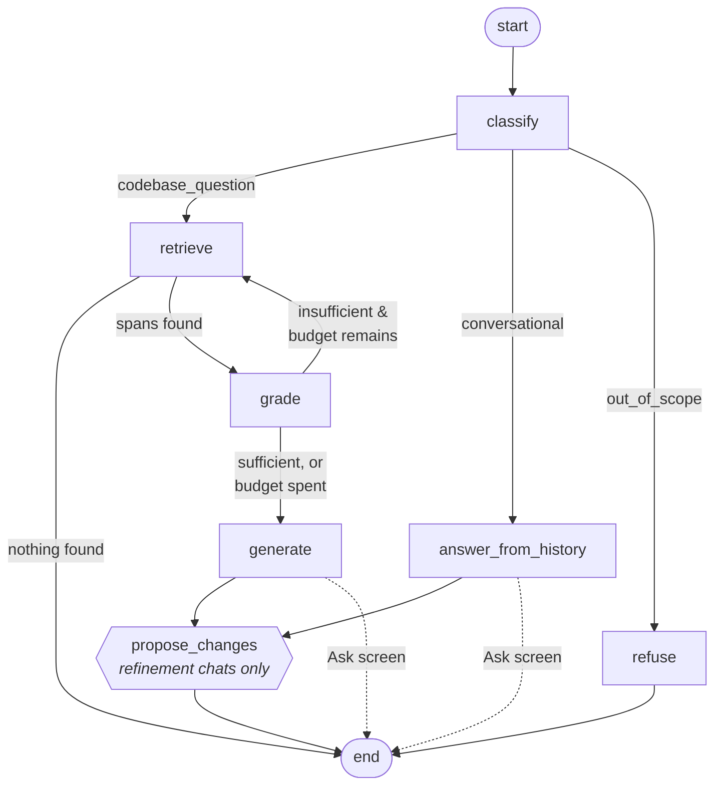

# The answer graph (LangGraph)

Answering a question is not one model call. It is a small state machine: route the question,
retrieve, judge whether the excerpts are good enough, maybe search again, then generate — while
streaming to the browser the whole time.

LangGraph is what holds that shape. This page covers the graph, and the streaming contract
around it.

Read [`rag.md`](rag.md) for what retrieval does and [`llm.md`](llm.md) for how each call is made.

---

## Why a graph instead of a chain

A chain runs A → B → C. This flow has three properties a chain cannot express:

1. **A question may not need retrieval at all.** "Thanks, that helped" should not search a
   vector store.
2. **Retrieval may need to run twice.** If the excerpts do not answer the question, a better
   search query should be tried.
3. **Different endings.** An out-of-scope question gets a fixed refusal; a conversational one is
   answered from history.

That is conditional routing and a bounded loop — a graph.

---

## The shape



Six always-present nodes, plus one optional tail. All are built in `app/rag/graph/build.py`;
the node bodies are in `nodes.py`.

| Node | Does | Structured? |
| --- | --- | --- |
| `classify` | Routes the question and rewrites it into a search query | Yes — `Classification` |
| `retrieve` | Searches Qdrant for the current `search_query` | No model call |
| `grade` | Judges the excerpts; may supply a better query | Yes — `EvidenceVerdict` |
| `generate` | Streams the cited answer from the excerpts | Streaming |
| `answer_from_history` | Answers a conversational follow-up with no retrieval | Streaming |
| `refuse` | Fixed text for an out-of-scope question | No model call |
| `propose_changes` / `propose_mock_data_changes` | Turns the turn into a pending change set | Yes |

### The shared state

`TurnState` is a `TypedDict` every node reads and writes:

```python
class TurnState(TypedDict):
    question: str            # what the user typed
    history: list[Turn]
    project_id: uuid.UUID
    generation: int          # which vector generation to search
    intent: Intent           # set by classify
    search_query: str        # rewritten by classify, replaced by grade on a retry
    spans: list[RetrievedChunk]
    attempts: int            # how many retrievals have run
    gap: str | None          # what grade said was missing
    evidence_ok: bool
    answer: str
    failure: FinishReason | None
```

`question` and `search_query` are separate on purpose: **the model answers what the user asked,
while retrieval embeds the rewritten query.**

---

## The corrective loop

`grade` is a self-critique step, and where it sits is the whole design:

> **It grades retrieval, not the finished answer.**

A critic that can reject a finished answer can only run on an answer that finished — which means
either buffering the whole draft (reintroducing the silence that streaming exists to remove) or
visibly retracting one already on screen. Grading the *excerpts* happens before a single token
is generated, so streaming is untouched.

When the verdict is `insufficient`, `grade` supplies a `better_query` and the graph loops back
to `retrieve`. `RAG_MAX_RETRIEVAL_ATTEMPTS` (default 2) bounds it.

**Every non-empty retrieval is graded, including the last one the budget allows.** Skipping the
final grade looks free — the verdict cannot send the graph back around, so why pay for it?
Because two things downstream read that verdict, and both then describe excerpts that no longer
exist: `weak_evidence` is raised from `evidence_ok`, so a re-retrieval that found exactly the
right code is still reported as weak; and `gap` is interpolated into the answer prompt, so the
model is told what was missing from excerpts it was *not* given. Specific, confident and wrong.

---

## Every node degrades; the grader never blocks

Each node falls back rather than failing the turn. `classify` falls back to
`codebase_question` plus the raw question. `grade` falls back to `sufficient`.

The grader's fallback is deliberately asymmetric, and it is the one to get right. A wrong
"insufficient" spends one extra retrieval and ends at `weak_evidence`. A grader that can *refuse*
an answer is a regression against the behaviour that shipped without it.

> **A helper node may never be the reason a question goes unanswered.**

`CancelledError` is a `BaseException` and is deliberately **not** caught by these handlers: a
client that disconnected mid-classification should stop the turn, not fall back and carry on
answering nobody.

Both helpers can be switched off entirely — `RAG_CLASSIFY_INTENT` and `RAG_GRADE_EVIDENCE`,
both default `true`. Turning both off reduces the graph to a straight retrieve-then-answer chain
and removes two model calls per question.

---

## One graph, three call sites

The same graph serves the Ask screen and both refinement chats. The difference is one
build-time argument:

```python
build_answer_graph(..., propose_target=None)          # /conversations — cannot propose
build_answer_graph(..., propose_target="checklist")   # checklist refinement chat
build_answer_graph(..., propose_target="mock_data")   # mock-data refinement chat
```

Each non-`None` value appends **one** node to the same graph shape rather than compiling a
second graph — because a second graph would mean a second adapter, and the adapter is where the
single-terminator guarantee lives.

Both answering routes feed the proposer: a refinement instruction may classify either way
("add a test for an empty password" is a codebase question, "make the third one clearer" is
conversational), and wiring only `generate` would silently drop every proposal of the second
kind. `refuse` does not feed it — an out-of-scope turn produced no answer to propose from.

`None` is the Ask screen's call site, so it **cannot** accidentally propose.

---

## Streaming: from graph to browser

Nodes write into LangGraph's stream; `app/rag/answerer.py` turns those writes into
Server-Sent Events. Seven event models, every one of them listed in `SSE_EVENT_MODELS`
(`app/schemas/__init__.py`) — the two change-set events share a row below:

| Event | When |
| --- | --- |
| `status` | Progress, before the answer starts |
| `citations` | **Exactly once, before the first token** |
| `token` | Each piece of the answer |
| `changeSet` / `mockDataChangeSet` | At most once, after the last token, on a refinement chat |
| `done` | Terminator — carries `finishReason`, `intent`, `groundingWarnings` |
| `error` | The other terminator — also carries `finishReason` |

### The ordering contract

- **`citations` is emitted exactly once on every route** — empty on the two that never retrieve —
  and always before the first `token`. A client must not need to know which route it got in order
  to parse the stream, and a stream that breaks mid-answer has still delivered citations for the
  partial it kept.
- **Exactly one terminator per stream**, and every terminator carries a `finishReason`. The
  service reads it off whichever it saw to decide what to persist.
- `Answerer._terminate` is **the only place** a `DoneEvent` or `ErrorEvent` is constructed. No
  node can emit one, which makes "exactly one terminator" structural rather than a rule six
  nodes each have to remember.

Within the retrieval loop, `citations` is emitted on the **first** attempt only. The accepted
consequence: after a re-retrieval the live sources panel shows the first attempt's spans while
the answer comes from the second. The stored message uses the final spans, so a reload
reconciles it. Deferring the event until the loop settles would hold the sources panel behind up
to two grader calls.

### Empty spans do not mean `no_context`

`grounding_warnings()` returns `[NO_CONTEXT]` for any empty span list — correct when retrieval
was the only path. The `conversational` and `out_of_scope` routes have empty spans because they
**never searched**. Reporting "nothing in the index matched" there describes a search that did
not happen, and the frontend renders it to the user as a warning. Both routes report
`groundingWarnings: []`, and `intent` in `done` carries the explanation instead.

---

## The shielded write

This is the subtlest thing in the streaming path.

A client disconnect arrives as `asyncio.CancelledError`, and **any `await` in a cancelled task
raises it again immediately**. So the obvious version writes nothing at all, losing the partial
answer in exactly the case the feature exists for:

```python
except asyncio.CancelledError:
    await session.commit()   # ← raises CancelledError again. Nothing is written.
```

`stream_turn` therefore does its cleanup in a `finally` under `asyncio.shield`. Inside it, order
matters:

1. **Cancel and await the in-flight `anext`** — closing a generator that is still running raises
   `RuntimeError`.
2. **Then close the answerer** — that is what releases the concurrency permit. Skip it and later
   answers queue behind a slot nobody holds.
3. **Then write the assistant row**, once, at termination — not per token. A per-token `UPDATE`
   would be thousands of writes for a row nobody reads until it is finished.

The stream also uses **its own session** from the sessionmaker, not the request-scoped one:
FastAPI closes `yield` dependencies through the request's `AsyncExitStack`, and a persistence
guarantee should not rest on when that runs relative to a streaming body.

---

## The pre-flight/stream split

Once SSE headers are sent, the status code is fixed at `200`. So everything that can legitimately
return something else — ownership, project readiness, the embedding-model guard — happens in
`prepare_turn`, **before** the `StreamingResponse` is returned.

This is why `ask_question` is the one route in the codebase that does two things: all the policy
still lives in the service, and the route only chooses the transport.

---

## Testing nodes

`emit()` resolves LangGraph's stream writer from the runnable context and **raises outside one**,
so a node cannot be called as a bare function in a test. Use the `run_node` harness in
`tests/test_graph.py`, which compiles a throwaway one-node graph — a node tested outside the
runtime would be tested in a state it never runs in.

And remember that ordinary tests drive a `ScriptedChatModel`, so none of them can catch a prompt
that routes or cites wrongly. `uv run pytest -m model` is what does, and it needs a real served
model.

---

## See also

- [`rag.md`](rag.md) — retrieval, grounding, and untrusted excerpts
- [`llm.md`](llm.md) — providers, structured output, retry classification
- [`data.md`](data.md) — where the change sets these chats propose end up
- [`PRD.md`](PRD.md) §4.2 — the specified streaming behaviour
