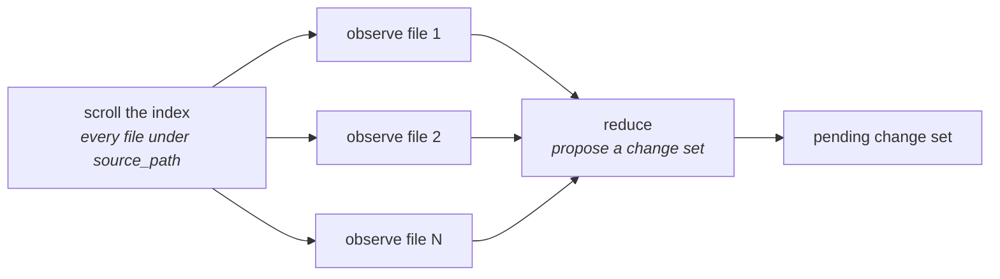

# How we call the LLM

Which model gets used, how it is invoked, how structured output works, and what stops a failing
provider from burning money or a retry ladder.

For how the calls are *sequenced* into an answer, read [`langgraph.md`](langgraph.md).

---

## Two models, deliberately separate

AskRepo uses two kinds of model and they are configured independently:

| | Setting prefix | Default | Where it runs |
| --- | --- | --- | --- |
| **Embedding model** | `EMBEDDING_*` | `nomic-embed-text` via Ollama | Worker only |
| **Chat model** | `CHAT_*` | `qwen2.5-coder` via Ollama | API **and** worker |

**Keep the embedder local even when the answerer is hosted.** The asymmetry is not cosmetic:
swapping the chat provider is free and reversible, while swapping the embedding provider changes
the Qdrant collection name, invalidates every vector in it, and costs a full re-index of every
project. `nomic-embed-text` is a 274 MB model that runs on anything; the multi-gigabyte answerer
is what makes a laptop unusable. Moving the chat model alone solves the resource problem at no
re-indexing cost.

**Ingestion uses no chat model at all.** It embeds. Checklist and mock-data generation each run
a chat model in the worker process; answering runs one in the API process.

---

## Choosing a provider

`app/rag/chat.py` is the whole of it — one factory, three branches, returning LangChain's
`BaseChatModel`:

```python
def build_chat_model(settings: Settings) -> BaseChatModel:
    if settings.chat_provider == "ollama":
        from langchain_ollama import ChatOllama
        return ChatOllama(model=..., base_url=..., temperature=...)

    if settings.chat_provider == "anthropic":
        from langchain_anthropic import ChatAnthropic
        return ChatAnthropic(model_name=..., base_url=..., api_key=..., temperature=...)

    from langchain_openai import ChatOpenAI
    return ChatOpenAI(model=..., base_url=..., api_key=..., temperature=...)
```

Three things about this are intentional:

- **Provider imports are local to their branch**, so an instance using a hosted provider never
  imports the local one and a broken optional dependency cannot break an unrelated deployment.
- **The `openai` branch is a catch-all.** Because it is an OpenAI-*compatible* client, setting
  `CHAT_BASE_URL` points it at OpenRouter, DeepSeek, Kimi, Groq, Together, or a self-hosted
  vLLM — **no code change required**. Anthropic needs its own branch only because its API is not
  OpenAI-shaped.
- **It returns `BaseChatModel`, not a hand-rolled protocol.** `astream` and `ainvoke` are the
  entire interface used, and LangChain ships streaming-capable test doubles; a protocol wrapping
  two methods would buy indirection and cost those fakes.

Switching providers is configuration, not a migration — no re-index, no change to stored
citations.

---

## Reasoning control

Some chat models spend most of their output on hidden chain-of-thought before the answer they
return — reasoning models, including plenty served through the `openai` catch-all branch above.
Left unconfigured, none of that is visible: the answer looks normal, while the bill and the
latency do not (issue #26). `CHAT_REASONING=off` tells `build_chat_model` to explicitly disable
it, in whatever vocabulary each provider actually uses:

| Provider | `CHAT_REASONING=off` sets | `CHAT_REASONING=default` (unset) |
| --- | --- | --- |
| Ollama | `reasoning=False` | nothing — the model's own default stands |
| Anthropic | `thinking={"type": "disabled"}` | nothing |
| OpenAI-compatible | `reasoning_effort="none"` | nothing |

`CHAT_EXTRA_MODEL_KWARGS` is the escape hatch for the `openai` branch specifically, because that
branch is a catch-all for *any* OpenAI-compatible endpoint (see above), and self-hosted servers
behind it — vLLM, SGLang, and similar — often expect a server-specific key instead of
`reasoning_effort`:

```bash
CHAT_EXTRA_MODEL_KWARGS={"chat_template_kwargs": {"enable_thinking": false}}
```

It is forwarded verbatim as `extra_body` and deliberately unvalidated: a key the endpoint does
not recognize is a provider error like any other, not a new failure mode. Ollama and Anthropic
have no equivalent field — their reasoning knobs above are already unambiguous, so there is
nothing for a generic pass-through to paper over.

Neither setting changes what the graph asks a model to produce — the content contract is
unaffected either way. Whether disabled reasoning costs answer or checklist quality is
unmeasured; `uv run pytest -m model` is the suite that would have an opinion.

---

## How LangChain is actually used

Two features, and that is nearly all of it.

### 1. Prompt templates

`app/rag/prompts.py` holds every prompt as a `ChatPromptTemplate` — `ANSWER_PROMPT`,
`CLASSIFY_PROMPT`, `GRADE_PROMPT`, `HISTORY_ANSWER_PROMPT`, plus the generation prompts
(`MAP_FILE_SYSTEM`, `REDUCE_SYSTEM`, `PROPOSE_SYSTEM`, and the mock-data pair).

Keeping them in one module matters more than it looks: **no ordinary test can catch a prompt
that routes or cites wrongly**, because every other test drives a `ScriptedChatModel`. That is
what `uv run pytest -m model` exists for — it needs a real served model. Run it after touching
this file.

### 2. Structured output

Every place the app needs a *shape* rather than prose goes through `with_structured_output`:

```python
model = self.chat_model.with_structured_output(FileObservations)
result = await model.ainvoke(build_map_prompt(file))
# result is a validated FileObservations, not a string to parse
```

LangChain turns the Pydantic model into a tool definition (or a JSON-mode schema), asks the
provider for it, and validates the response. There is no JSON parsing and no "please respond in
this format" prompt-wrangling in our code.

The structured paths are: `classify` and `grade` in the answer graph, and the map, reduce and
propose steps in both generators.

**This is why the boot probe exists.** `with_structured_output` needs tool-calling or a JSON
mode, and a model lacking it does not degrade politely — the reduce step raises "returned an
unusable shape", the job retries, and the module dead-letters with a message naming the symptom
and not the cause. Worse, an aggregator will happily serve such a model without saying so.

```python
# app/rag/capability.py — runs in main.py's lifespan and worker.py's startup
model = chat_model.with_structured_output(TrivialProbeSchema)
result = await model.ainvoke("Reply with any short string in the `answer` field.")
if not isinstance(result, TrivialProbeSchema):
    raise TerminalChatError("configured chat model did not return a usable structured response")
```

**The process refuses to boot** rather than failing on the first generation. The probe is
provider-agnostic on purpose — it asks nothing about which model is configured, so it verifies
any `CHAT_BASE_URL`/`CHAT_MODEL` pair the same way, including an endpoint nobody has catalogued.

---

## Retry classification

A hosted provider fails in ways a local endpoint never does, and getting this backwards is
expensive in both directions: a dead-lettered job that would have succeeded on retry, or a retry
ladder hammering a provider that has already said no.

```python
_RETRYABLE = {"RateLimitError", "APIConnectionError", "APITimeoutError", "InternalServerError",
              "OverloadedError",
              # LangChain's provider-agnostic bases
              "ModelRateLimitError", "ModelConnectionError", "ModelTimeoutError", "ModelAPIError"}
_TERMINAL  = {"AuthenticationError", "NotFoundError", "BadRequestError", "PermissionDeniedError",
              "ModelAuthenticationError", "ModelNotFoundError", "ModelInvalidRequestError",
              "ContextOverflowError"}
```

| Class | Meaning | What happens |
| --- | --- | --- |
| `RetryableChatError` | Rate limit, outage, connection blip | Goes on the retry ladder — 1 min, then 10 min |
| `TerminalChatError` | Rejected key, unknown model, context-length rejection | Straight to the dead-letter queue |
| Unmapped | Anything else | Returns `None`; the caller falls through to its own unclassified-failure net |

**Classified by exception class name, not `isinstance`.** The `openai` and `anthropic` SDKs were
generated by the same tooling and raise identically-named exceptions from different modules, so
matching by name means this function needs no import from either package.

**Every name in the MRO is matched, not just the leaf — and that has a scar on it.** LangChain
wraps each provider failure in a subclass of its own before it reaches this code:
`openai.APITimeoutError` arrives as `OpenAITimeoutError`, and its Anthropic twin as
`AnthropicTimeoutError`. While only the leaf name was matched, this function classified
**nothing at all** from either provider — every chat failure fell through to the unclassified
net, so a rate limit got one attempt instead of three and a rejected key got a pointless retry.
Nothing reported it; the ladder simply stopped behaving as documented. Fixed 2026-09-08.

Deliberately not exhaustive: an unmapped name returns `None` rather than guessing.

**The provider client performs no retries of its own** (`PROVIDER_RETRIES = 0` in
`app/rag/chat.py`). LangChain defaults to `max_retries=2`, which would stack a second retry
mechanism under this one: a hung call would cost its timeout three times over before
raising, and the Kafka ladder would then retry that whole thing again. It would also bypass the
table above, since the client retries on its own rules rather than on this classification.

---

## The shape of a generation run

Checklist generation is **map/reduce**, and its cost profile follows directly:



- **One model call per file**, bounded by `CHECKLIST_MAP_CONCURRENCY` (default 4) via a
  semaphore, run inside an `asyncio.TaskGroup` rather than `gather` — because `gather` with the
  default `return_exceptions=False` leaves siblings running after one fails; a TaskGroup cancels
  them.
- **Plus one reduce call** that turns all the observations into a proposed change set.

So `N + 1` calls for an `N`-file module. On a hosted provider that is a bill, which is why
`CHECKLIST_MAX_FILES_PER_JOB` (default 200) exists: a per-run cap on how many files one run
maps. Exceeding it does not fail the job — it degrades to the first 200 files, sorted by path
for a deterministic cut, with the rest reported in `skipped_paths`.

**The generator scrolls the index; it does not search it.** Top-k retrieval cannot report what
it left out, and a test plan that silently omits a file is worse than one that says which files
it covered.

---

## Concurrency and timeouts

| Setting | Default | Bounds |
| --- | --- | --- |
| `CHAT_MAX_CONCURRENCY` | 2 | Simultaneous *answer* streams, instance-wide. A semaphore on `app.state`, shared by all three streaming routes |
| `CHAT_TIMEOUT_SECONDS` | 180 | How long **any one interactive model call** may take — the answer stream's whole-answer budget, and the per-request timeout on the API process's client, so classify and grade are bounded too |
| `GENERATION_TIMEOUT_SECONDS` | 600 | The same bound on the **worker's** client, where checklist map/reduce and mock-data generation run. Longer on purpose: nothing is streaming and nobody is waiting |
| `CHECKLIST_MAP_CONCURRENCY` | 4 | Simultaneous per-file calls within one generation run |

The answer semaphore is held for the length of a stream and **released when the answerer is
closed**. If that close is skipped, later answers queue behind a slot nobody holds — see
[`langgraph.md`](langgraph.md) for where that happens.

---

## What a hosted answerer costs you

[`PRD.md`](PRD.md) §1 describes a self-hosted, single-tenant tool on an organization's own
network. **A hosted answerer sends retrieved source code to a third party on every question.**

That is a deliberate trade an operator makes per instance, not a default. If it is not
acceptable, run the chat model locally — the seam exists so both are possible.

**Nothing here measures what it costs.** No code path reads token usage: not the answer stream,
not the map call this page's generation diagram runs once per file, not the reduce. So an
instance can tell you which provider it is configured for and not how many tokens it has spent
with it, and the per-run bound (`CHECKLIST_MAX_FILES_PER_JOB`) caps one generation rather than
cumulative usage. A per-call record of tokens, timing, model and outcome is specified in
[`PRD.md`](PRD.md) §2.1 — including the two reasons it is more than a column: the answer path
streams, where usage is reported only when explicitly asked for, and `with_structured_output`
discards the raw response that carries it.

---

## See also

- [`langgraph.md`](langgraph.md) — how these calls are sequenced into an answer
- [`rag.md`](rag.md) — what goes into the prompt, and why excerpts are untrusted
- [`configuration.md`](configuration.md) — every `CHAT_*` and `EMBEDDING_*` setting
- [`PRD.md`](PRD.md) §6 — the provider-abstraction rationale
